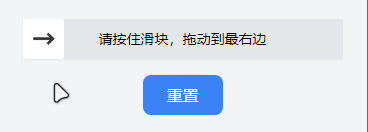

# React-Simple-Slide-Captcha

React-Simple-Slide-Captcha 是一个用于用户滑块行为验证的 React 组件。

## 演示



## 安装

```bash
npm install react-simple-slide-captcha
```

## 基础使用

```tsx
import React from 'react'
import SlideCaptcha from 'react-simple-slide-captcha'

const App = () => {
    const handleSlideCaptchaChange = (isSuccess: boolean) => {
        if (isSuccess) {
            console.log('验证成功！')
        }
    }

    return (
        <div>
            <SlideCaptcha onChange={handleSlideCaptchaChange} />
        </div>
    )
}

export default App
```

## 用户指南

#### 属性

| 属性名       | 描述                                           | 默认值                     |
| :----------- | :--------------------------------------------- | :------------------------- |
| width        | 组件宽度，为 0 时自适应                        | 300                        |
| height       | 组件高度，也是滑块高度，滑块宽度等于滑块高度   | 48                         |
| defaultLabel | 默认文案                                       | '请按住滑块，拖动到最右边' |
| defaultLabel | 成功文案                                       | '验证成功'                 |
| failLabel    | 失败文案                                       | '验证失败，请重新验证'     |
| onChange     | 回调函数，成功 isSuccess 为 true，失败为 false | (isSuccess) => {}          |

#### 方法

```tsx
import React, { useRef } from 'react'
import SlideCaptcha, { SlideCaptchaHandle } from 'react-simple-slide-captcha'

const App = () => {
    const slideCaptchaRef = useRef<SlideCaptchaHandle>()

    const handleClick() {
        if (slideCaptchaRef.current) slideCaptchaRef.current.reset()
    }

    return (
        <div>
            <SlideCaptcha ref={slideCaptchaRef} />
            <button onClick={handleClick}>重置</button>
        </div>
    )
}

export default App
```
